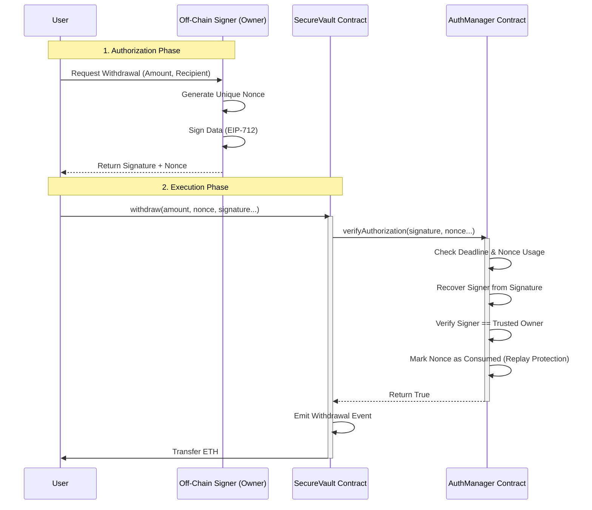

# Secure Vault System

A decentralized vault architecture separating asset custody from authorization logic. This system implements a **Secure Vault** that holds funds and an **Authorization Manager** that validates off-chain EIP-712 signatures before permitting withdrawals.

## 📖 System Overview

The system is designed to minimize on-chain gas costs and improve security by off-loading the authorization logic to a signed message standard.

* **SecureVault (`SecureVault.sol`):** Responsible solely for holding ETH and transferring it. It blindly trusts the Authorization Manager.
* **AuthorizationManager (`AuthorizationManager.sol`):** Acts as the gatekeeper. It verifies cryptographic signatures and ensures that a specific authorization (nonce) is used exactly once.

## 🏗 System Architecture

The system consists of three main components: the Off-Chain Signer, the Vault, and the Authorization Manager.

### Component Diagram
This diagram shows the static relationships and trust boundaries between contracts.

```mermaid
graph TD
    User((User)) -->|1. Request Auth| Owner[Off-Chain Signer\n(Owner Key)]
    User -->|2. Submit Withdraw| Vault[SecureVault\n(Holds Funds)]
    
    subgraph On-Chain System
        Vault -->|3. Verify| Auth[AuthorizationManager\n(Checks Signatures)]
        Auth -->|4. Result| Vault
    end
    
    Owner -.->|Sign EIP-712| User
```

## 🏗 Architecture & Interaction Flow

The system follows a strict **Request-Sign-Execute** pattern.

### Sequence Diagram
The following diagram illustrates the lifecycle of a withdrawal:


## Security Design
### 1. Authorization (EIP-712)
We use the EIP-712 standard ("Typed Structured Data Hashing and Signing").

Why? It prevents signature ambiguity. The user sees exactly what they are signing in a readable format, rather than an opaque hex string.

Domain Binding: Signatures are bound to the specific chainId and verifyingContract address. A signature generated for the Testnet cannot be used on Mainnet, nor can it be used on a different Vault instance.

### 2. Replay Protection (Nonces)
To ensure funds cannot be withdrawn multiple times using the same valid signature:

Every authorization includes a unique bytes32 nonce.

The AuthorizationManager maintains a mapping: mapping(bytes32 => bool) public isNonceConsumed;.

Once a signature is verified, its nonce is marked true. Any subsequent attempt to use that nonce reverts immediately.

### 3. Checks-Effects-Interactions
The contracts strictly follow the CEI pattern to prevent reentrancy attacks:

Checks: Verify signature and nonce availability.

Effects: Mark the nonce as consumed (isNonceConsumed[nonce] = true).

Interactions: Only after state updates is the ETH transferred to the recipient.

## Setup & Deployment
The project is fully containerized. You do not need Node.js or Hardhat installed on your host machine.

## Prerequisites
- Docker Desktop
- Git

## Instructions
### 1. Clone the repository:
```
git clone <YOUR_REPO_URL>
cd secure-vault-system
```

### 2. Start the System: 
Run the following command to build the container, start the local blockchain, and deploy contracts automatically:
```
docker-compose up --build
```
Wait until you see the log message: SecureVault deployed to: 0x...

### Run Tests (Verification): 
Open a new terminal window and run the automated test suite inside the running container:
```
docker-compose exec vault-system npx hardhat test
```

## Repository Structure
```/
├── contracts/               # Smart Contracts
│   ├── AuthorizationManager.sol
│   └── SecureVault.sol
├── docker/                  # Infrastructure configuration
│   ├── Dockerfile
│   └── entrypoint.sh
├── scripts/                 # Deployment scripts
│   └── deploy.js
├── test/                    # Automated System Tests
│   └── system.spec.js
├── docker-compose.yml       # Container orchestration
├── hardhat.config.js        # Hardhat configuration
└── README.md                # Documentation
```

## Assumptions & Limitations
Centralized Signer: The system currently relies on a single "Owner" account to generate signatures off-chain. If this private key is compromised, the vault is compromised. In a production environment, this should be a Multi-Sig or MPC wallet.

Ether Only: The current implementation supports Native ETH transfers. It does not support ERC-20 tokens.

Gas Management: The vault does not automatically top up its own gas for internal calls (though minimal gas is required for the internal logic).

Immutable Owner: For simplicity in this task, ownership is set to the deployer and cannot be transferred. A production version would use Ownable2Step for secure ownership transfer.